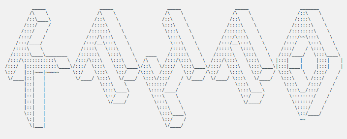

<p align="center">

<br><br>
<a title="License" target="_blank" href="https://github.com/cheng-zhongliang/kfifo/blob/master/LICENSE"></a>
</p>

`kfifo` is a ring queue inspired by linux kernel. It is simple and efficient that can be used in embedded systems.

## Features

- Ultra Fast
- Lock Free
- Thread Safe(Single Producer With Single Consumer)
- Supports C99 And UP

## Usage

**[kfifo.h](kfifo.h?raw=1)** should be dropped into an existing project and compiled along with it. The library provides some 
macros for using. Talking is cheap, show you a sample following:

```c
#include <assert.h>
#include "kfifo.h"

int main(void) {
    _KFIFO(kfifo, int) kfifo;
    KFIFO_INIT(&kfifo, 1000);
    assert(KFIFO_CAPACITY(&kfifo) == 1023);
    do {
        KFIFO_ENQUEUE(&kfifo, 1);
    } while(!KFIFO_FULL(&kfifo));
    assert(KFIFO_LENGTH(&kfifo) == 1023);
    do {
        KFIFO_DEQUEUE(&kfifo);
    } while(!KFIFO_EMPTY(&kfifo));
    assert(KFIFO_LENGTH(&kfifo) == 0);
    KFIFO_FREE(&kfifo);
    return 0;
}
```